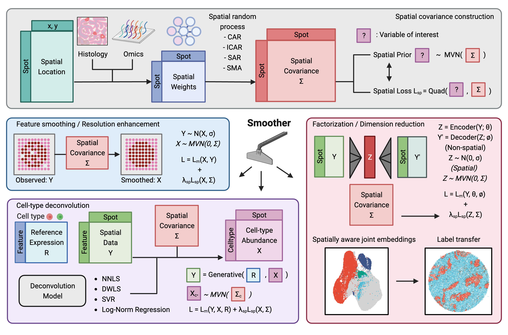

Smoother - A unified spatial dependency framework in PyTorch
=====================================================================================================

.. toctree::
   :maxdepth: 2
   :hidden:
   :caption: Basics

   installation
   usage
   loss_design

.. toctree::
   :maxdepth: 2
   :hidden:
   :caption: Tutorials

   tutorials/quickstart
   tutorials/tutorial_impute
   tutorials/tutorial_deconv
   tutorials/tutorial_dr
   tutorials/tutorial_joint_mapping

.. toctree::
   :maxdepth: 2
   :hidden:
   :caption: API Reference

   autoapi/smoother/index

Smoother is a Python package built for modeling spatial dependency and enforcing spatial coherence in spatial omics data analysis. 
Implemented in Pytorch, Smoother is modular and ultra-efficient, often capable of analyzing samples tens of thousands of spots in seconds. 

The key innovation of Smoother is the decoupling of the prior belief on spatial structure (i.e., `neighboring spots tend to be more similar`) 
from the likelihood of a non-spatial data-generating model. This flexibility allows the same prior to be used in different models, 
and the same model to accommodate data with varying or even zero spatial structures. In other words, Smoother can be seamlessly integrated 
into existing non-spatial models and pipelines (e.g. single-cell analyses) and make them spatially aware. 
In particular, Smoother provides the following functionalities:

What it provides:

1. **Spatial loss:** A quadratic loss equivalent to a Gaussian random field (MVN) prior derived from a boundary-aware graph.
2. **Imputation and resolution enhancement:** Denoise by borrowing from neighbors and upscale to arbitrary resolutions in seconds.
3. **Cell-type deconvolution:** Spatially coherent abundance estimates using cell-type references.
4. **Dimensionality reduction:** Spatially aware embeddings that also enable joint analysis with non-spatial single-cell data.

For method details, please refer to the `Smoother paper (Su Jiayu, et al. 2023) <https://link.springer.com/article/10.1186/s13059-023-03138-x>`_ and the `Supplementary Notes <https://github.com/JiayuSuPKU/Smoother/blob/main/docs/Smoother_sup_notes.pdf>`_.
Check out the :doc:`installation` and :doc:`usage` sections for further information, including installation instructions and example usages.

.. note::

   This documentation is under active development. More tutorials on scvi-based models will be added soon.

Reference
---------------
Su, Jiayu, et al. "Smoother: a unified and modular framework for incorporating structural dependency in spatial omics data." Genome Biology 24.1 (2023): 291.
https://link.springer.com/article/10.1186/s13059-023-03138-x
